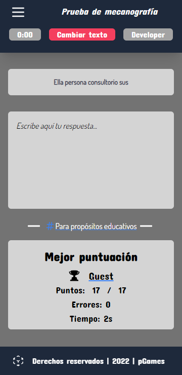

# Mecanografia

**Instalación**
```bash
npm install
```
Para guardar los cambios de estilos
```
npx tailwindcss  -i ./style.css -o ./tailwind/output.css --watch
```


Cuenta con:

- Estadísticas locales, bien se registre como usuario o invitado, se guardará las estadísticas de la prueba y mostrará la siguiente vez que acceda a la página.
- Cantidad de párrafos definible.
- Menú responsivo, con enlaces a futuros proyectos.
- Cambio de color, cuando el texto sea: 
```diff
- Incorrecto.
+ Correcto.
# Aún no se ha escrito.
```

_Un vistazo a la apariencia de la página_:

> Para pantallas de celular / móvil / teléfono:




***
> Para pantallas superiores:


***


Hecha con propósitos de aprendizaje en lenguaje JavaScript, HTML semántico y [Tailwind CSS](https://tailwindcss.com) .
